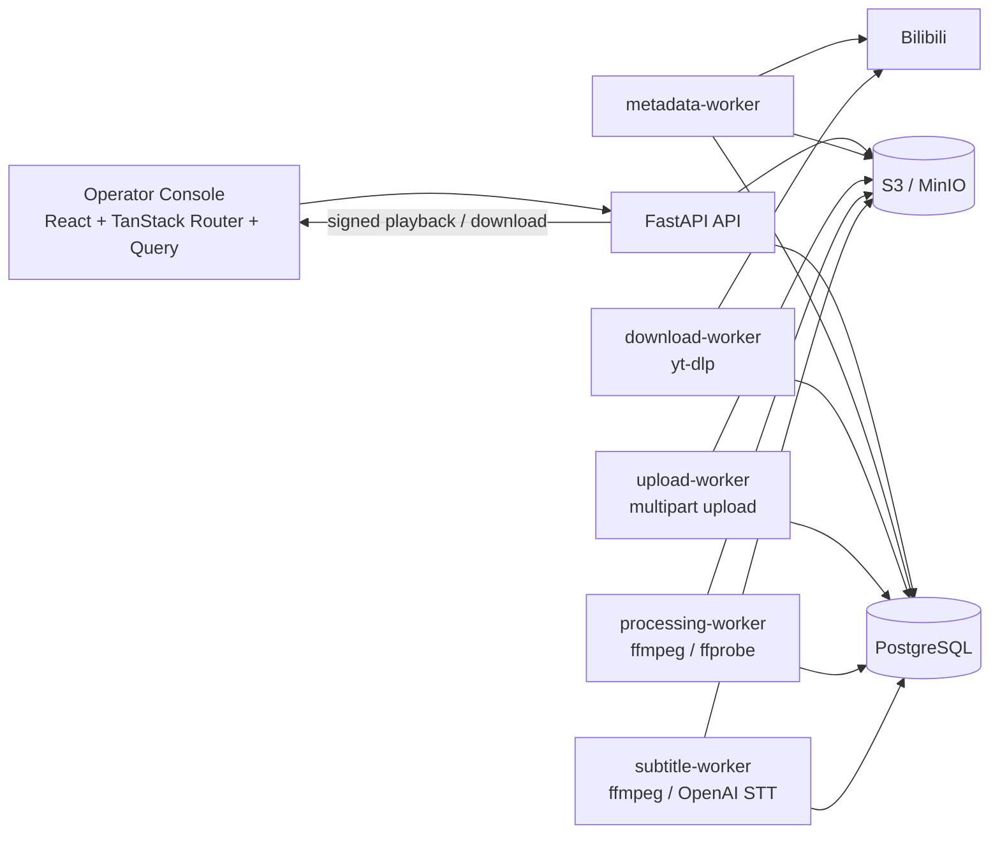
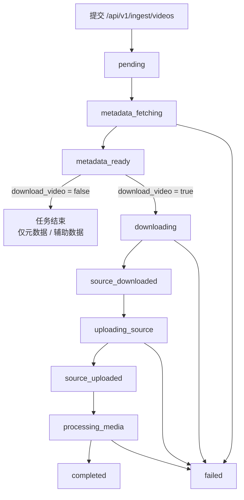

# Bilibili Media Ingestion Service

面向内部采集管理与数据审查的 Bilibili 媒资入库系统。

这个仓库已经不是通用 FastAPI 模板，而是一套完整的采集、审查和后台管理工具链，核心目标是把 Bilibili 视频及其附属信息稳定地拉取、落库、上传到对象存储、生成可检查的衍生文件，并通过一个内部控制台统一操作和审查。

## 项目解决什么问题

- 提交 BVID 或 Bilibili 视频链接，创建采集任务。
- 抓取视频基础元数据、UP 主信息、分 P、统计快照。
- 按需抓取评论、评论图片、弹幕、字幕等辅助数据。
- 用 `yt-dlp` 下载源文件，用 S3 Multipart 上传到对象存储。
- 用 `ffmpeg` / `ffprobe` 生成标准化 MP4、代理 MP4、HLS 包和缩略图。
- 通过 React 控制台查看任务状态、视频详情、媒资清单和辅助数据完整性。
- 为受保护视频提供 Bilibili 登录态配置，并对播放 / 下载链接做签名控制。

## 核心能力

### 后端

- FastAPI 提供认证、用户管理、采集任务、视频查询、媒资访问和系统设置接口。
- PostgreSQL 持久化视频、任务、媒资、评论、弹幕、字幕、审计日志等数据。
- Alembic 维护数据库 schema。
- 五类 worker 轮询数据库任务并推进采集流水线。

### 采集流水线

- `metadata-worker` 抓取视频元数据，并可顺带抓取评论、评论图片、弹幕、字幕。
- `download-worker` 通过 `yt-dlp` 下载源视频或源音视频流。
- `upload-worker` 将下载产物上传到 S3 兼容对象存储。
- `processing-worker` 用 `ffmpeg` 生成衍生媒资，并写回可播放资产记录。
- `subtitle-worker` 会在源文件上传后提取纯音频、调用 OpenAI STT，并生成字幕资产。

### 前端控制台

- Dashboard 用于提交采集任务、查看最近任务和最近视频。
- Videos 页用于浏览视频、媒资、评论、评论图片、弹幕、字幕和完整性摘要，并支持内部质检用播放检查。
- Admin 页用于用户管理和 Bilibili 登录态管理。
- Settings 页用于个人信息、密码和账户删除。

### 安全和管控特性

- JWT 登录鉴权。
- 超级管理员才能管理用户、删除视频、更新系统级 Bilibili Cookie。
- 媒资下载 / 播放接口使用带过期时间的签名 URL。
- 资产和视频支持 `takedown` 状态控制。
- 关键操作和任务转换写入 `audit_events`。
- 数据库中保存的 Bilibili Cookie Header 会加密存储。

## 系统架构



## 采集流程



采集任务的真实状态机由数据库中的 `ingest_jobs` 驱动。一个只抓元数据的任务不会进入 `completed`，而是停在 `metadata_ready`，这表示元数据已落库，但没有进入下载和转码链路。

## 核心数据模型

- `IngestJob`: 一次采集请求及其状态、阶段、错误、进度。
- `Video`: 视频主记录，包含标题、简介、分区、标签、统计快照引用等。
- `VideoPage`: 分 P 信息和 `cid`。
- `MediaAsset`: 所有源文件和衍生文件的统一资产表。
- `Uploader`: UP 主快照信息。
- `VideoComment`: 评论正文。
- `VideoCommentImage`: 评论图片及其对象存储状态。
- `VideoDanmaku`: 弹幕明细。
- `VideoSubtitle`: 字幕正文。
- `AuditEvent`: 后台操作和任务变更审计日志。
- `AppSecret`: 系统级密文配置，目前用于 Bilibili Cookie Header 数据库覆盖。

当前采集链路会显式生成或持久化以下常见资产类型：

- `cover`
- `avatar`
- `comment_image`
- `source_archive`
- `source_video_stream`
- `source_audio_stream`
- `normalized_mp4`
- `proxy_mp4`
- `hls_master`
- `hls_segment`
- `thumbnail`
- `subtitle`

OpenAI 转写字幕会写入 `video_subtitles` 供查询和质检使用，同时把完整 JSON 作为 `subtitle` 资产上传到对象存储。

## 目录结构

```text
.
├── backend/
│   ├── app/
│   │   ├── api/          # FastAPI 路由和依赖
│   │   ├── core/         # 配置、数据库、鉴权
│   │   ├── crawler/      # Bilibili 元数据 / 辅助数据抓取器
│   │   ├── downloader/   # yt-dlp 下载适配层
│   │   ├── processor/    # ffmpeg / ffprobe 处理层
│   │   ├── services/     # 采集、上传、转码、签名 URL 等业务逻辑
│   │   ├── uploader/     # S3 Multipart 上传实现
│   │   ├── workers/      # metadata / download / upload / processing worker
│   │   └── alembic/      # 数据库迁移
│   ├── scripts/
│   └── tests/
├── frontend/
│   ├── src/
│   │   ├── routes/       # Dashboard / Videos / Admin / Settings / Auth 页面
│   │   ├── components/   # UI 和业务组件
│   │   ├── client/       # OpenAPI 生成客户端
│   │   └── lib/
│   └── tests/            # Playwright 端到端测试
├── scripts/              # 根目录脚本，例如生成 OpenAPI client
├── compose.yml           # 主运行编排
├── compose.override.yml  # 本地开发覆盖
├── development.md        # 本地开发说明
├── deployment.md         # 部署说明
└── SECURITY.md           # 安全说明
```

## 技术栈

### Backend

- Python 3.10
- FastAPI
- SQLModel
- Alembic
- PostgreSQL
- `yt-dlp`
- `ffmpeg` / `ffprobe`
- `botocore` S3 Multipart Upload
- `uv`
- `pytest`, `mypy`, `ruff`, `ty`

### Frontend

- React 19
- TypeScript
- Vite
- TanStack Router
- TanStack Query
- Tailwind CSS 4
- shadcn/ui
- Playwright
- Bun

### 本地运行栈

- Docker Compose
- MinIO
- Mailcatcher
- Adminer
- Traefik（本地代理调试）

## 主要接口

所有正式接口都挂在 `/api/v1` 下。

### 认证和用户

- `POST /login/access-token`: 获取 JWT。
- `POST /login/test-token`: 校验当前 token。
- `POST /password-recovery/{email}`: 发起密码找回。
- `POST /reset-password/`: 重置密码。
- `GET /users/me`: 获取当前用户。
- `PATCH /users/me`: 更新当前用户资料。
- `PATCH /users/me/password`: 修改当前用户密码。
- `POST /users/signup`: 自助注册。
- `GET /users/`, `POST /users/`, `PATCH /users/{user_id}`, `DELETE /users/{user_id}`: 超级管理员用户管理。

### 采集任务

- `POST /ingest/videos`: 提交采集任务。
- `GET /ingest/jobs`: 分页查看任务。
- `GET /ingest/jobs/{job_id}`: 查看单个任务详情。

示例请求：

```json
{
  "input": "https://www.bilibili.com/video/BV1xx411c7mD",
  "options": {
    "download_video": true,
    "max_height": null,
    "store_source_archive": true,
    "create_normalized_mp4": true,
    "create_hls": true,
    "fetch_comments": true,
    "fetch_danmaku": true,
    "fetch_subtitles": true,
    "transcribe_subtitles": true,
    "force_refresh": false
  }
}
```

`max_height` 传 `null` 或省略时，会按站点可用清晰度下载最佳版本；需要限制下载分辨率时再传具体高度。

### 视频和辅助数据

- `GET /videos/`: 按 BVID 或标题搜索视频。
- `GET /videos/{bvid}`: 查看视频详情。
- `DELETE /videos/{bvid}`: 超级管理员删除视频及其对象存储内容。
- `GET /videos/{bvid}/assets`: 查看视频资产，可按 `asset_type` 过滤。
- `GET /videos/{bvid}/comments`: 查看评论，可按线程根评论和父评论过滤。
- `GET /videos/{bvid}/comment-images`: 查看评论图片，可按 `rpid` / `root` / `parent` / `storage_status` 过滤。
- `GET /videos/{bvid}/danmaku`: 查看弹幕，可按 `cid` / `source` / `history_date` 过滤。
- `GET /videos/{bvid}/subtitles`: 查看字幕，可按 `cid` / `lang` 过滤。

### 媒资访问

- `GET /media/assets/{asset_id}`: 查看资产详情。
- `POST /media/assets/{asset_id}/signed-url`: 生成下载签名 URL。
- `POST /media/assets/{asset_id}/playback-url`: 生成播放签名 URL。
- `GET /media/assets/{asset_id}/download?token=...`: 获取资产下载描述。
- `GET /media/assets/{asset_id}/playback?token=...`: 通过后端代理播放资产。

说明：

- 播放接口会校验资产状态和 takedown 状态。
- HLS master / playlist 会在返回时重写子引用，替换为新的签名 URL。
- 这个播放链路更适合内部检查和质检，不是公网大规模分发 CDN。

### 系统接口

- `GET /system/bilibili-access`: 查看当前 Bilibili 登录态配置。
- `PUT /system/bilibili-access`: 保存数据库中的 Cookie Header 覆盖。
- `DELETE /system/bilibili-access`: 清除数据库覆盖。
- `GET /utils/health-check/`: 健康检查。
- `POST /utils/test-email/`: 超级管理员测试邮件。

### 仅本地环境启用

- `/private/*` 只在 `ENVIRONMENT=local` 时挂载，主要用于本地调试辅助。

## 前端页面说明

### Dashboard

- 提交 BVID / URL 采集任务。
- 选择是否下载视频、生成 HLS、抓取评论 / 弹幕 / 字幕等。
- 查看最近任务和最近视频。
- 超级管理员还会看到 Bilibili 登录态摘要。

### Videos

- 搜索并选择视频。
- 查看元数据、统计信息、资产列表。
- 查看评论树、评论图片、弹幕、字幕和完整性摘要。
- 生成内部质检用播放地址，检查封面、缩略图、代理 MP4、HLS。
- 可触发评论和弹幕的辅助刷新任务。

### Admin

- 管理用户账户和权限。
- 在数据库中保存或清除 Bilibili Cookie Header 覆盖。

### Settings 和 Auth

- 支持个人资料更新、改密、删号。
- 提供登录、注册、找回密码、重置密码页面。

## 快速开始

### 前置依赖

- Docker 和 Docker Compose
- Bun
- `uv`
- 如果要在宿主机直接跑 worker，额外需要本机可用的 `yt-dlp`、`ffmpeg`、`ffprobe`
- 如果要在宿主机直接跑 `download-worker`，建议使用支持 impersonation 的
  `yt-dlp nightly + curl_cffi`

### 1. 启动整套本地栈

最简单的方式：

```bash
docker compose up -d --build
```

开发期推荐用文件同步和热重载：

```bash
docker compose watch
```

默认可访问地址：

- Frontend: `http://localhost:5173`
- Backend API: `http://localhost:8000`
- Swagger UI: `http://localhost:8000/docs`
- Adminer: `http://localhost:8080`
- Traefik UI: `http://localhost:8090`
- MinIO Console: `http://localhost:9001`
- Mailcatcher: `http://localhost:1080`

`prestart` 容器会在启动时自动做三件事：

1. 等待数据库可连接  
2. 执行 `alembic upgrade head`  
3. 根据环境变量创建首个超级管理员

首个超级管理员由以下环境变量决定：

- `FIRST_SUPERUSER`
- `FIRST_SUPERUSER_PASSWORD`

### 2. 单独运行前端

```bash
bun install
bun run dev
```

### 3. 单独运行后端

```bash
cd backend
uv sync
uv run alembic upgrade head
uv run fastapi dev app/main.py
```

如果本地 Docker 栈已经占用 `8000` 端口，先停掉 `backend` 服务。

### 4. 单独运行 worker

先停掉对应容器，再在 `backend/` 下运行：

```bash
uv run python -m app.workers.metadata_ingest --once
uv run python -m app.workers.download_ingest --once
uv run python -m app.workers.upload_ingest --once
uv run python -m app.workers.media_processing --once
uv run python -m app.workers.subtitle_transcription --once
uv run python -m app.workers.subtitle_backfill --bvid BV1xx411c7mD
uv run python -m app.workers.subtitle_backfill --bvid BV1xx411c7mD --replace-existing
```

每个 worker 也支持：

- `--poll-interval`
- `--stale-after`
- `--once`
- `--max-jobs`

其中 metadata worker 额外支持：

- `--inter-job-delay`

字幕 backfill 命令额外支持：

- `--bvid`
- `--cid`
- `--limit`
- `--replace-existing`

## 配置说明

配置入口在 [backend/app/core/config.py](./backend/app/core/config.py)。

### 环境文件约定

- `.env`: 仓库跟踪的默认模板 / 默认值集合，不要放真实生产密钥。
- `.env.local`: 本地开发私有覆盖。
- `.env.test`: 宿主机 pytest 默认测试配置。
- `.env.test.local`: 本地私有测试覆盖。

### 基础配置

以下变量在非本地环境里应显式设置：

- `ENVIRONMENT`
- `PROJECT_NAME`
- `FRONTEND_HOST`
- `BACKEND_PUBLIC_URL`
- `SECRET_KEY`
- `MEDIA_SIGNING_SECRET`
- `FIRST_SUPERUSER`
- `FIRST_SUPERUSER_PASSWORD`
- `POSTGRES_SERVER`
- `POSTGRES_PORT`
- `POSTGRES_DB`
- `POSTGRES_USER`
- `POSTGRES_PASSWORD`

### 对象存储

完整媒资流水线依赖 S3 兼容对象存储：

- `S3_ENDPOINT_URL`
- `S3_ACCESS_KEY`
- `S3_SECRET_KEY`
- `S3_BUCKET`
- `S3_REGION`
- `S3_FORCE_PATH_STYLE`
- `S3_MULTIPART_CHUNK_SIZE_BYTES`

本地 Compose 默认接入 MinIO。

### Bilibili 登录态

用于抓取受限视频、评论、弹幕或字幕：

- `BILIBILI_COOKIE_HEADER`
- `YT_DLP_COOKIES_FILE`
- `YT_DLP_COOKIES_FROM_BROWSER`
- `YT_DLP_USER_AGENT`
- `YT_DLP_IMPERSONATE`

优先级说明：

- Metadata crawler 优先使用 Admin 页面保存的 Netscape `cookies.txt`
  派生出的 raw `Cookie` header；如果数据库里没有，再回退到
  `BILIBILI_COOKIE_HEADER`。
- `yt-dlp` 优先使用 Admin 页面保存的 Netscape `cookies.txt` 和可选下载 UA。
- `YT_DLP_COOKIES_FILE`、`YT_DLP_COOKIES_FROM_BROWSER`、`YT_DLP_USER_AGENT`
  只作为下载 worker 的环境兜底。
- `YT_DLP_IMPERSONATE` 建议保持为 `chrome`，否则 B 站媒体流更容易返回 `403`。

### 可调参数

- `BILIBILI_METADATA_TIMEOUT_SECONDS`
- `BILIBILI_METADATA_RETRY_ATTEMPTS`
- `BILIBILI_REQUEST_MIN_INTERVAL_SECONDS`
- `BILIBILI_REQUEST_JITTER_SECONDS`
- `BILIBILI_WBI_KEY_CACHE_TTL_SECONDS`
- `BILIBILI_COMMENT_EMPTY_PAGE_RETRY_ATTEMPTS`
- `METADATA_WORKER_POLL_INTERVAL_SECONDS`
- `METADATA_WORKER_INTER_JOB_DELAY_SECONDS`
- `DOWNLOAD_WORKER_POLL_INTERVAL_SECONDS`
- `UPLOAD_WORKER_POLL_INTERVAL_SECONDS`
- `PROCESSING_WORKER_POLL_INTERVAL_SECONDS`
- `METADATA_WORKER_STALE_AFTER_SECONDS`
- `DOWNLOAD_WORKER_STALE_AFTER_SECONDS`
- `UPLOAD_WORKER_STALE_AFTER_SECONDS`
- `PROCESSING_WORKER_STALE_AFTER_SECONDS`
- `SIGNED_URL_EXPIRE_SECONDS`
- `INGEST_TMP_DIR`
- `YT_DLP_BINARY`
- `FFMPEG_BINARY`
- `FFPROBE_BINARY`
- `FFMPEG_VIDEO_ACCELERATOR`: 默认 `cpu`，可设为 `videotoolbox`（macOS）或
  `nvenc`（NVIDIA ffmpeg 构建）启用硬件 H.264 编码；容器部署启用 `nvenc`
  时还需要给 worker 配好 NVIDIA runtime / GPU device。

### 邮件和观测

- `SMTP_HOST`
- `SMTP_PORT`
- `SMTP_TLS`
- `SMTP_SSL`
- `SMTP_USER`
- `SMTP_PASSWORD`
- `EMAILS_FROM_EMAIL`
- `EMAILS_FROM_NAME`
- `SENTRY_DSN`

## 开发常用命令

### 根目录

```bash
bun install
bun run dev
bun run build
bun run lint
bun run test
bash ./scripts/generate-client.sh
```

`scripts/generate-client.sh` 会做三件事：

1. 从后端导出 OpenAPI schema  
2. 刷新 `frontend/src/client/`  
3. 顺带跑一次前端 lint

### Backend

```bash
cd backend
uv sync
bash ./scripts/lint.sh
bash ./scripts/test.sh
uv run pytest
uv run alembic upgrade head
```

### Frontend

```bash
bun run dev
bun run build
bun run lint
bun run test
```

## 测试策略

### Backend

- `backend/tests/api/`: API 路由测试
- `backend/tests/services/`: 采集、上传、转码、Bilibili 访问、S3 Multipart、yt-dlp 适配等服务测试
- `backend/tests/crud/`: 用户 CRUD 测试
- `backend/tests/scripts/`: 启动脚本相关测试

完整 backend 测试：

```bash
cd backend
uv run pytest
```

带覆盖率报告：

```bash
cd backend
bash ./scripts/test.sh
```

宿主机 pytest 默认会通过 `backend/tests/conftest.py` 将 `APP_ENV` 设为 `test`，因此会自动加载仓库根目录的 `.env.test`。

如果要启动专用测试数据库：

```bash
docker compose --profile test up -d test-db
```

### Frontend

Playwright 测试位于 `frontend/tests/`：

```bash
bun run test
```

### 全栈脚本

仓库根目录提供一键测试脚本：

```bash
bash ./scripts/test.sh
```

它会构建镜像、拉起测试栈、运行 backend 测试，再自动清理容器和卷。

## 部署说明

- `compose.yml` 是主运行编排文件。
- `compose.override.yml` 只用于本地开发。
- `compose.traefik.yml` 用于公共 Traefik 入口。
- 详细部署流程见 [deployment.md](./deployment.md)。

生产部署前需要注意：

- 默认 `compose.yml` 里的 backend、prestart 和 worker 仍然把 `POSTGRES_SERVER` 写死为 `db`，如果你要接外部 PostgreSQL，需要先改这部分编排。
- 当前播放链路通过后端代理对象存储文件，更适合作为内部检查入口，而不是高并发公网播放服务。
- 生产环境应替换 `.env` 默认值，尤其是 `SECRET_KEY`、`MEDIA_SIGNING_SECRET`、`POSTGRES_PASSWORD`、`FIRST_SUPERUSER_PASSWORD`。

## 相关文档

- [development.md](./development.md): 本地开发说明
- [deployment.md](./deployment.md): 部署说明
- [backend/README.md](./backend/README.md): 后端细节
- [frontend/README.md](./frontend/README.md): 前端细节
- [CONTRIBUTING.md](./CONTRIBUTING.md): 协作方式
- [SECURITY.md](./SECURITY.md): 安全政策

## 当前定位

这是一个内部采集管理和数据审查系统，不是公开面向终端用户的视频站点。它强调的是：

- 采集流程可控
- 任务状态可追踪
- 辅助数据可审查
- 媒资对象可签名访问
- 问题可定位、可重跑、可审计

如果你要找的是一个纯播放站、一个通用 CMS、或者一个面向大众的在线视频产品，这个仓库的边界不是那里。
