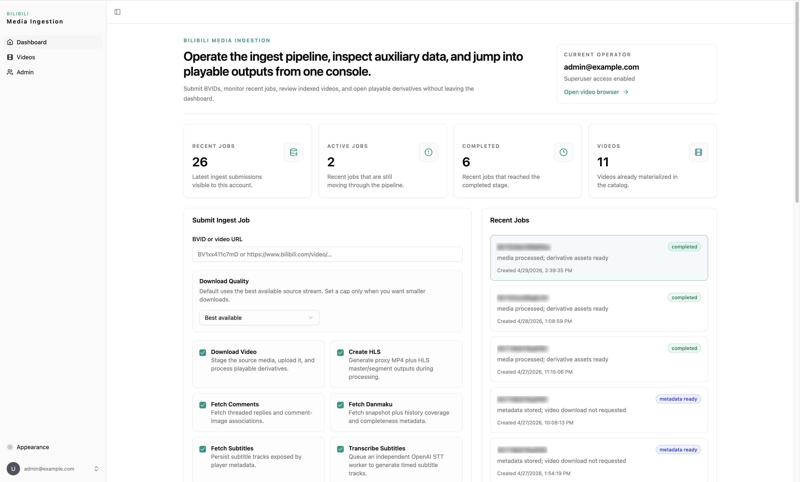
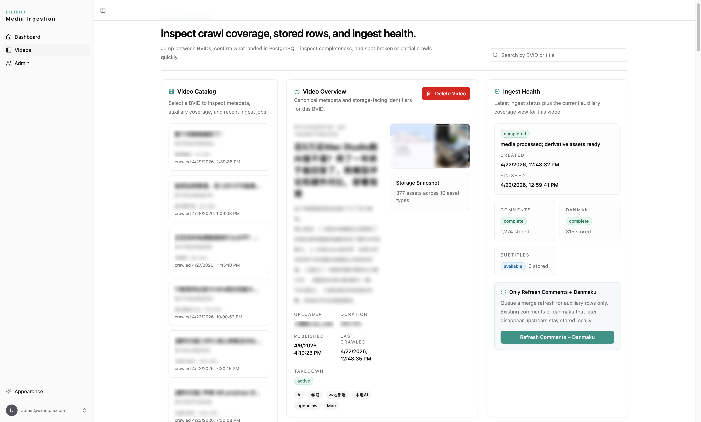
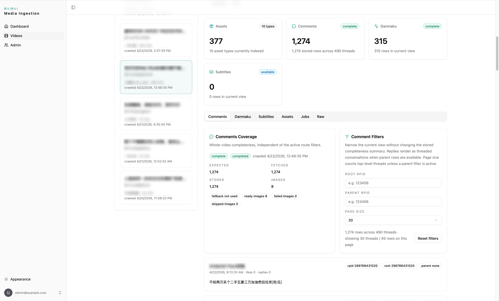
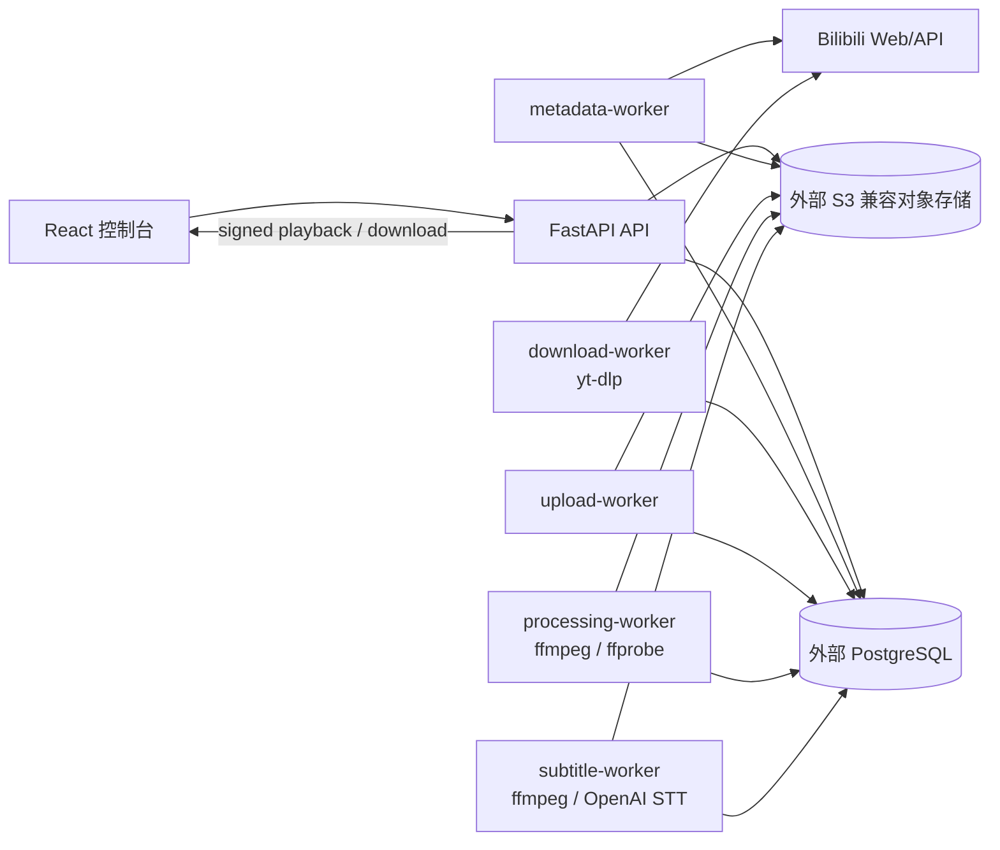
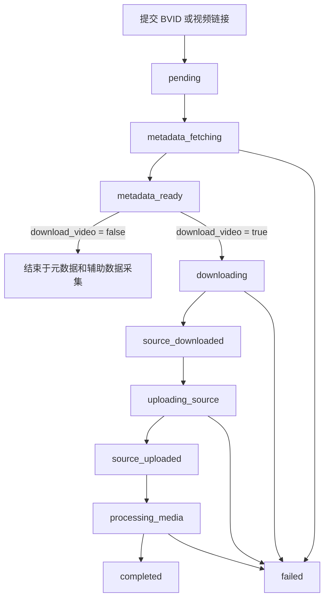
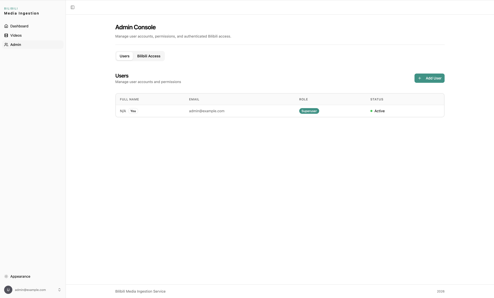
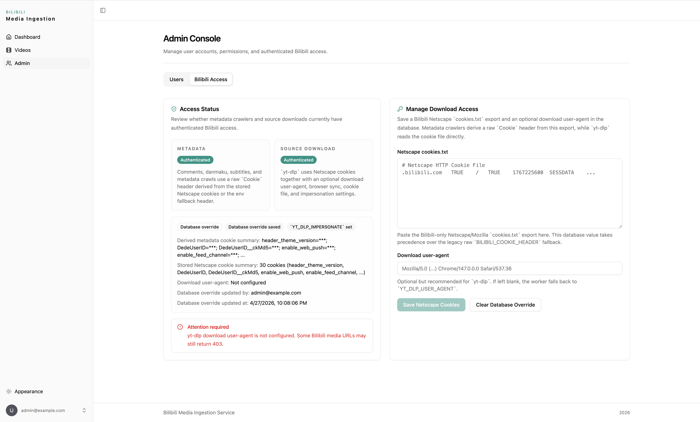

# Bilibili Media Ingestion Service

通过 Bilibili 的 BV 号或视频链接收集视频、弹幕、评论和相关元数据的数据收集项目。

这个项目主要用于个人学习和个人知识检索场景：提交一个 BVID 或 Bilibili 视频链接后，系统会创建采集任务，抓取视频元数据、评论、弹幕、字幕，并可按需下载视频源文件、生成可检查的媒资文件。它不是公开爬虫平台，也不是大规模数据抓取工具。

## 项目定位

实现这个项目的直接原因，是我发现 B 站视频评论区里经常会出现很多时间上很新的讨论、经验、知识和数据。这些内容有时比传统搜索引擎、问答站、社交平台或其他资料库更接近事件现场，也更容易保留上下文。

因此我想做一个面向自己使用的检索引擎，把这些讨论和视频上下文收集、落库、索引起来。这个仓库先解决其中的第一步：稳定、可追踪地收集数据。

## 使用边界

请先明确这个项目不做什么：

- 不支持账号池。
- 不支持 IP 池、代理池或自动切换出口。
- 不支持绕过平台风控的批量采集能力。
- 不支持作为大规模爬虫、公开采集服务或商业化数据抓取系统使用。
- 不提供绕过版权、权限、登录限制或平台规则的能力。

这个项目的设计目标是个人学习、个人归档和个人检索。使用时需要自行遵守 Bilibili 用户协议、版权要求、隐私要求以及所在地法律法规。Cookie、视频文件、评论数据和弹幕数据都可能包含敏感信息，不要公开分发，不要提交到 Git 仓库。

## 功能概览

### 输入

- 支持提交 BVID，例如 `BV1xx411c7mD`。
- 支持提交 Bilibili 视频链接，例如 `https://www.bilibili.com/video/BV1xx411c7mD`。
- 支持提交 Bilibili 短链分享文本，例如 `【视频标题-哔哩哔哩】 https://b23.tv/abc123`。
- 后端会从输入中解析出标准 BVID，并以采集任务的形式推进后续流程。

### 数据采集

- 视频基础信息：标题、简介、分区、标签、发布时间等。
- UP 主信息：名称、头像、MID 等快照信息。
- 分 P 信息：每个分 P 的 `cid`、标题、时长等。
- 统计快照：播放、点赞、投币、收藏、分享、评论数等。
- 评论：根评论、楼中楼、评论正文、评论时间、点赞数和原始响应。
- 评论图片：评论中出现的图片会作为独立资产入库并上传对象存储。
- 弹幕：按视频 `cid` 抓取弹幕内容、时间点、颜色、模式等信息。
- 字幕：抓取视频公开字幕；也可以基于下载后的视频音频转写字幕。

### 视频和媒资处理

- 可选下载视频源文件，使用 `yt-dlp` 处理 Bilibili 媒体流。
- 可选保存源归档、源视频流和源音频流。
- 可选生成标准化 MP4。
- 可选生成代理 MP4、HLS master playlist、HLS segment 和缩略图。
- 使用 S3 兼容对象存储保存封面、头像、评论图片、视频文件、转码产物和字幕文件。
- 媒资访问接口支持短期签名 URL，便于在控制台里做个人检查。

### 字幕转写

- 可选调用 OpenAI 语音转写接口。
- 转写前会用 `ffmpeg` 从视频资产中提取音频。
- 转写结果会写入 `video_subtitles`，完整 JSON 也会作为字幕资产上传到对象存储。

### 管理控制台

- Dashboard：提交采集任务，查看最近任务和最近视频。
- Videos：搜索视频，查看元数据、评论、评论图片、弹幕、字幕和媒资列表。
- Admin：管理用户，并维护 Bilibili Cookie。
- Settings：管理个人资料、密码和账户。

### 页面预览

Dashboard 用于提交采集任务、选择采集范围，并查看最近任务状态。



Videos 页面用于检索已采集视频，查看元数据、采集健康状态和辅助数据覆盖情况。



评论、弹幕、字幕、资产和原始数据都可以在视频详情里按 tab 检查。



### 后端和 worker

- FastAPI 提供 API、鉴权、用户管理、任务管理、视频查询和媒资访问。
- PostgreSQL 保存任务、视频、评论、弹幕、字幕、用户和审计日志。
- Alembic 维护数据库 schema。
- worker 从数据库中轮询任务并推进采集流水线：
  - `metadata-worker`：抓取元数据、评论、弹幕、字幕和图片资产。
  - `download-worker`：下载视频源文件。
  - `upload-worker`：上传源文件和衍生文件到对象存储。
  - `processing-worker`：使用 `ffmpeg` 生成标准化 MP4、HLS、缩略图等。
  - `subtitle-worker`：提取音频并调用 OpenAI STT 生成字幕。

## 系统架构



## 采集流程



只采集评论、弹幕、字幕和元数据时，任务通常会停在 `metadata_ready`，这表示数据已经落库，但没有进入下载和转码链路。

## Cookie 获取和配置

部分视频、评论、弹幕或媒体流需要登录态。项目支持两种方式配置 Bilibili Cookie：

- 推荐方式：在 Admin 页面粘贴 Netscape `cookies.txt` 内容，由系统保存到数据库。
- 环境变量兜底：通过 `BILIBILI_COOKIE_HEADER`、`YT_DLP_COOKIES_FILE` 或 `YT_DLP_COOKIES_FROM_BROWSER` 配置。

推荐使用 Chrome 插件 [Get cookies.txt LOCALLY](https://chromewebstore.google.com/detail/get-cookiestxt-locally/cclelndahbckbenkjhflpdbgdldlbecc) 导出 Bilibili 的 Netscape 格式 Cookie。

### 操作步骤

1. 在 Chrome 中安装 `Get cookies.txt LOCALLY`。
2. 用自己的 Bilibili 账号登录 `https://www.bilibili.com`。
3. 打开插件，选择导出当前站点或 Bilibili 相关 Cookie。
4. 选择 Netscape `cookies.txt` 格式。
5. 登录本项目控制台，进入 `Admin -> Bilibili Access`。
6. 将导出的 `cookies.txt` 内容粘贴进去并保存。
7. 提交一个仅抓取元数据、评论和弹幕的小任务，确认 Cookie 可用。

Admin 页面可以管理用户，也可以维护 Bilibili 登录态。



在 `Bilibili Access` 里保存 Netscape `cookies.txt` 后，metadata crawler 会从中派生 raw `Cookie` header，`yt-dlp` 下载流程会直接使用保存的 Netscape cookies。



Cookie 等同于登录凭证。不要把 `cookies.txt`、`BILIBILI_COOKIE_HEADER`、`.env.local` 或截图里的敏感内容提交到仓库。

## Docker 部署

这个项目的 Docker 编排只负责应用本身。数据库、对象存储、反向代理、邮件服务等都按外部依赖处理。

### 外部依赖

部署前需要准备：

- PostgreSQL：保存任务、视频、评论、弹幕、字幕、用户和审计日志。
- S3 兼容对象存储：保存封面、头像、评论图片、视频文件、HLS、缩略图和字幕资产。
- 可选 SMTP：用于注册、找回密码、测试邮件。
- 可选 OpenAI API Key：只在启用字幕转写时需要。
- 可选反向代理：例如 Nginx、Traefik、Caddy，用于 HTTPS、域名和端口转发。

`compose.yml` 中包含这些服务：

- `prestart`：启动前等待数据库、执行 Alembic 迁移、创建首个超级管理员。
- `backend`：FastAPI API 服务。
- `metadata-worker`：元数据、评论、弹幕、字幕和图片采集 worker。
- `download-worker`：视频下载 worker。
- `upload-worker`：对象存储上传 worker。
- `processing-worker`：转码和衍生媒资 worker。
- `subtitle-worker`：字幕转写 worker。
- `frontend`：React 前端的 Nginx 静态服务。

`compose.yml` 还定义了一个 `ingest-tmp` named volume，并挂载到后端和所有 worker 的 `INGEST_TMP_DIR`。下载、上传、转码和字幕转写会通过这个目录交接临时文件，生产环境如果视频文件较大，建议把该 volume 映射到容量足够的磁盘。

### Dockerfile 说明

后端和 worker 使用同一个 Dockerfile：

```bash
docker build \
  -f backend/Dockerfile \
  --target backend-runtime \
  -t bili-ingest-backend:latest \
  .
```

前端使用独立 Dockerfile，`VITE_API_URL` 是构建期参数：

```bash
docker build \
  -f frontend/Dockerfile \
  --build-arg VITE_API_URL=https://api.example.com \
  -t bili-ingest-frontend:latest \
  .
```

如果使用仓库自带 `compose.yml`，默认会分别构建 backend image 和 frontend image：

```bash
docker compose -f compose.yml build
docker compose -f compose.yml up -d
```

Compose 支持通过 `DOCKER_IMAGE_BACKEND`、`DOCKER_IMAGE_FRONTEND` 和 `TAG` 覆盖镜像名。前端 API 地址由 `VITE_API_URL` 在构建时写入静态资源，因此生产构建前需要先确认它指向正确的后端公开地址。容器启动后再改环境变量不会改变已构建前端的 API 地址，需要重新构建前端镜像，或另外实现运行时配置。

本地调试时可以叠加 `compose.override.yml`，它会暴露本地端口并启用开发配置：

```bash
docker compose -f compose.yml -f compose.override.yml up -d --build
```

默认本地访问地址：

- Frontend: `http://localhost:5173`
- Backend API: `http://localhost:8000`
- Swagger UI: `http://localhost:8000/docs`
- Mailcatcher: `http://localhost:1080`

生产环境通常需要自己增加端口映射或接入反向代理。示例：

```yaml
services:
  backend:
    ports:
      - "8000:8000"

  frontend:
    ports:
      - "5173:80"
```

如果 PostgreSQL 或 S3 部署在同一台宿主机上，不要在容器里把地址写成 `localhost`。容器里的 `localhost` 指向容器自身，应改成 Docker 网络里的服务名、宿主机可访问地址，或 Docker Desktop 的 `host.docker.internal`。

### 最小部署流程

1. 准备外部 PostgreSQL，并创建数据库和用户。
2. 准备外部 S3 兼容对象存储，并创建 bucket 和访问密钥。
3. 准备 `.env.local` 或生产环境变量。
4. 构建并启动服务。
5. 查看 `prestart` 是否完成数据库迁移和超级管理员初始化。
6. 登录前端控制台，进入 Admin 页面配置 Bilibili Cookie。
7. 提交一个小视频的元数据采集任务验证链路。

示例命令：

```bash
cp .env.minimal .env.local
# 编辑 .env.local，填入真实数据库、对象存储、密钥、站点地址和可选 OpenAI/SMTP 配置

docker compose -f compose.yml up -d --build
docker compose -f compose.yml logs -f prestart backend metadata-worker
```

## 环境变量

配置入口在 [backend/app/core/config.py](./backend/app/core/config.py)。仓库里的 `.env` 只适合作为默认值集合，不要把真实生产密钥写进去提交。完整功能配置示例见 [.env.minimal](./.env.minimal)，建议复制为 `.env.local` 后再填写真实值。

### 基础配置

| 变量 | 必需 | 说明 |
| --- | --- | --- |
| `ENVIRONMENT` | 是 | `local`、`staging` 或 `production`。生产环境不要使用 `local`。 |
| `PROJECT_NAME` | 是 | API 文档、邮件等位置展示的项目名。 |
| `FRONTEND_HOST` | 是 | 前端公开访问地址，例如 `https://bili.example.com`。 |
| `BACKEND_PUBLIC_URL` | 是 | 后端公开访问地址，签名播放和下载 URL 会使用它。 |
| `BACKEND_CORS_ORIGINS` | 是 | 允许跨域访问的前端地址，多个地址用英文逗号分隔。 |
| `SECRET_KEY` | 是 | JWT 和安全相关逻辑使用的密钥，生产环境必须替换。 |
| `MEDIA_SIGNING_SECRET` | 建议 | 媒资签名 URL 使用的密钥；为空时回退到 `SECRET_KEY`。 |
| `FIRST_SUPERUSER` | 是 | 首个超级管理员邮箱。 |
| `FIRST_SUPERUSER_PASSWORD` | 是 | 首个超级管理员密码，生产环境必须替换。 |
| `ACCESS_TOKEN_EXPIRE_MINUTES` | 否 | 登录 token 过期时间，默认 8 天。 |

### Docker 和前端构建变量

| 变量 | 必需 | 说明 |
| --- | --- | --- |
| `DOCKER_IMAGE_BACKEND` | 否 | Compose 使用的后端 / worker 镜像名，默认 `backend`。 |
| `DOCKER_IMAGE_FRONTEND` | 否 | Compose 使用的前端镜像名，默认 `frontend`。 |
| `TAG` | 否 | Compose 使用的镜像 tag，默认 `latest`。 |
| `VITE_API_URL` | 前端构建时必需 | 前端构建期 API 地址，例如 `https://api.example.com`。 |
| `NODE_ENV` | 否 | 前端构建环境，默认按 Dockerfile / Compose 配置。 |

### PostgreSQL

| 变量 | 必需 | 说明 |
| --- | --- | --- |
| `POSTGRES_SERVER` | 是 | PostgreSQL 主机名或地址。容器部署时不要误填容器内的 `localhost`。 |
| `POSTGRES_PORT` | 是 | PostgreSQL 端口，默认 `5432`。 |
| `POSTGRES_DB` | 是 | 数据库名。 |
| `POSTGRES_USER` | 是 | 数据库用户。 |
| `POSTGRES_PASSWORD` | 是 | 数据库密码。 |

### S3 兼容对象存储

| 变量 | 必需 | 说明 |
| --- | --- | --- |
| `S3_ENDPOINT_URL` | 是 | S3 兼容服务地址，例如 MinIO、SeaweedFS 或云厂商 S3 endpoint。 |
| `S3_ACCESS_KEY` | 是 | 对象存储访问 key。 |
| `S3_SECRET_KEY` | 是 | 对象存储 secret key。 |
| `S3_BUCKET` | 是 | 保存媒资的 bucket。 |
| `S3_REGION` | 否 | S3 region；部分兼容服务可以留空。 |
| `S3_FORCE_PATH_STYLE` | 否 | MinIO、SeaweedFS 等通常设为 `true`。 |
| `S3_MULTIPART_CHUNK_SIZE_BYTES` | 否 | Multipart 上传分片大小，默认 `8388608`。 |

### Bilibili 访问

| 变量 | 必需 | 说明 |
| --- | --- | --- |
| `BILIBILI_COOKIE_HEADER` | 否 | raw `Cookie` header 兜底配置。推荐使用 Admin 页面保存 Netscape cookies。 |
| `BILIBILI_API_BASE_URL` | 否 | Bilibili API base URL，默认 `https://api.bilibili.com`。 |
| `YT_DLP_COOKIES_FILE` | 否 | `yt-dlp` 使用的 Netscape cookies 文件路径。 |
| `YT_DLP_COOKIES_FROM_BROWSER` | 否 | `yt-dlp --cookies-from-browser` 配置。容器里通常不建议依赖宿主机浏览器。 |
| `YT_DLP_USER_AGENT` | 否 | 下载媒体流时使用的 User-Agent。 |
| `YT_DLP_IMPERSONATE` | 否 | 建议设为 `chrome`，降低媒体流请求失败概率。 |
| `BILIBILI_METADATA_USER_AGENT` | 否 | 元数据请求使用的 User-Agent。 |
| `BILIBILI_ACCEPT_LANGUAGE` | 否 | Bilibili 请求使用的 `Accept-Language`。 |
| `BILIBILI_REQUEST_MIN_INTERVAL_SECONDS` | 否 | Bilibili 请求最小间隔。 |
| `BILIBILI_REQUEST_JITTER_SECONDS` | 否 | 请求间隔随机抖动。 |
| `BILIBILI_WBI_KEY_CACHE_TTL_SECONDS` | 否 | WBI key 缓存时间。 |
| `BILIBILI_COMMENT_EMPTY_PAGE_RETRY_ATTEMPTS` | 否 | 评论空页重试次数。 |
| `BILIBILI_METADATA_TIMEOUT_SECONDS` | 否 | 元数据请求超时。 |
| `BILIBILI_METADATA_RETRY_ATTEMPTS` | 否 | 元数据请求重试次数。 |

登录态优先级：

1. Admin 页面保存的 Netscape `cookies.txt`。
2. 环境变量 `BILIBILI_COOKIE_HEADER`。
3. 下载 worker 的 `YT_DLP_COOKIES_FILE` 或 `YT_DLP_COOKIES_FROM_BROWSER` 兜底配置。

### 下载、转码和临时文件

| 变量 | 必需 | 说明 |
| --- | --- | --- |
| `INGEST_TMP_DIR` | 是 | 下载、转码、图片处理和字幕转写的临时目录。生产环境建议挂载到容量足够的磁盘。 |
| `YT_DLP_BINARY` | 否 | `yt-dlp` 可执行文件路径，容器中默认可用。 |
| `FFMPEG_BINARY` | 否 | `ffmpeg` 可执行文件路径，容器中默认可用。 |
| `FFPROBE_BINARY` | 否 | `ffprobe` 可执行文件路径，容器中默认可用。 |
| `FFMPEG_VIDEO_ACCELERATOR` | 否 | 默认 `cpu`；也可配置 `videotoolbox` 或 `nvenc`，但需要宿主机和容器运行时支持。 |
| `SIGNED_URL_EXPIRE_SECONDS` | 否 | 媒资下载和播放签名 URL 的默认过期时间。 |

### worker 参数

| 变量 | 必需 | 说明 |
| --- | --- | --- |
| `METADATA_WORKER_POLL_INTERVAL_SECONDS` | 否 | metadata worker 轮询间隔。 |
| `METADATA_WORKER_INTER_JOB_DELAY_SECONDS` | 否 | metadata worker 两个任务之间的间隔。 |
| `DOWNLOAD_WORKER_POLL_INTERVAL_SECONDS` | 否 | download worker 轮询间隔。 |
| `UPLOAD_WORKER_POLL_INTERVAL_SECONDS` | 否 | upload worker 轮询间隔。 |
| `PROCESSING_WORKER_POLL_INTERVAL_SECONDS` | 否 | processing worker 轮询间隔。 |
| `SUBTITLE_WORKER_POLL_INTERVAL_SECONDS` | 否 | subtitle worker 轮询间隔。 |
| `METADATA_WORKER_STALE_AFTER_SECONDS` | 否 | metadata 任务占用超时回收时间。 |
| `DOWNLOAD_WORKER_STALE_AFTER_SECONDS` | 否 | download 任务占用超时回收时间。 |
| `UPLOAD_WORKER_STALE_AFTER_SECONDS` | 否 | upload 任务占用超时回收时间。 |
| `PROCESSING_WORKER_STALE_AFTER_SECONDS` | 否 | processing 任务占用超时回收时间。 |
| `SUBTITLE_WORKER_STALE_AFTER_SECONDS` | 否 | subtitle 任务占用超时回收时间。 |

### OpenAI 字幕转写

| 变量 | 必需 | 说明 |
| --- | --- | --- |
| `OPENAI_API_KEY` | 启用转写时必需 | OpenAI API Key。 |
| `OPENAI_API_BASE_URL` | 否 | OpenAI API base URL，默认 `https://api.openai.com/v1`。 |
| `OPENAI_TRANSCRIPTION_MODEL` | 否 | 转写模型，默认 `whisper-1`。 |
| `OPENAI_TRANSCRIPTION_LANGUAGE` | 否 | 转写语言提示。 |
| `OPENAI_TRANSCRIPTION_TIMEOUT_SECONDS` | 否 | 转写请求超时。 |
| `OPENAI_TRANSCRIPTION_TEMPERATURE` | 否 | 转写 temperature。 |
| `SUBTITLE_TRANSCRIPTION_AUDIO_FORMAT` | 否 | 转写前导出的音频格式，支持 `m4a` 或 `flac`。 |
| `SUBTITLE_TRANSCRIPTION_AUDIO_BITRATE` | 否 | 音频码率。 |
| `SUBTITLE_TRANSCRIPTION_AUDIO_COMPRESSION_LEVEL` | 否 | 音频压缩等级。 |
| `SUBTITLE_TRANSCRIPTION_AUDIO_SAMPLE_RATE` | 否 | 音频采样率。 |
| `SUBTITLE_TRANSCRIPTION_MAX_UPLOAD_BYTES` | 否 | 单次上传音频大小上限。 |

### 邮件和观测

| 变量 | 必需 | 说明 |
| --- | --- | --- |
| `SMTP_HOST` | 否 | SMTP 服务地址。 |
| `SMTP_PORT` | 否 | SMTP 端口。 |
| `SMTP_TLS` | 否 | 是否启用 STARTTLS。 |
| `SMTP_SSL` | 否 | 是否启用 SSL。 |
| `SMTP_USER` | 否 | SMTP 用户。 |
| `SMTP_PASSWORD` | 否 | SMTP 密码。 |
| `EMAILS_FROM_EMAIL` | 否 | 发件邮箱。 |
| `EMAILS_FROM_NAME` | 否 | 发件人名称。 |
| `EMAIL_RESET_TOKEN_EXPIRE_HOURS` | 否 | 密码重置 token 过期小时数。 |
| `EMAIL_TEST_USER` | 否 | 测试邮件默认收件人。 |
| `SENTRY_DSN` | 否 | Sentry DSN。 |
| `RUN_LIVE_S3_SMOKE` | 否 | 是否启用真实 S3 smoke 测试，通常只在开发或 CI 中临时开启。 |

## API 示例

所有业务接口挂在 `/api/v1` 下。提交采集任务：

```http
POST /api/v1/ingest/videos
```

只采集元数据、评论和弹幕：

```json
{
  "input": "https://www.bilibili.com/video/BV1xx411c7mD",
  "options": {
    "download_video": false,
    "max_height": null,
    "store_source_archive": false,
    "create_normalized_mp4": false,
    "create_hls": false,
    "fetch_comments": true,
    "fetch_danmaku": true,
    "fetch_subtitles": false,
    "transcribe_subtitles": false,
    "force_refresh": true
  }
}
```

采集完整媒资链路：

```json
{
  "input": "BV1xx411c7mD",
  "options": {
    "download_video": true,
    "max_height": null,
    "store_source_archive": true,
    "create_normalized_mp4": true,
    "create_hls": true,
    "fetch_comments": true,
    "fetch_danmaku": true,
    "fetch_subtitles": true,
    "transcribe_subtitles": true,
    "force_refresh": false
  }
}
```

常用查询接口：

- `GET /api/v1/ingest/jobs`：查看任务列表。
- `GET /api/v1/ingest/jobs/{job_id}`：查看任务详情。
- `GET /api/v1/videos/`：搜索视频。
- `GET /api/v1/videos/{bvid}`：查看视频详情。
- `GET /api/v1/videos/{bvid}/comments`：查看评论。
- `GET /api/v1/videos/{bvid}/comment-images`：查看评论图片。
- `GET /api/v1/videos/{bvid}/danmaku`：查看弹幕。
- `GET /api/v1/videos/{bvid}/subtitles`：查看字幕。
- `GET /api/v1/videos/{bvid}/assets`：查看媒资资产。
- `POST /api/v1/media/assets/{asset_id}/signed-url`：生成下载签名 URL。
- `POST /api/v1/media/assets/{asset_id}/playback-url`：生成播放签名 URL。
- `GET /api/v1/system/bilibili-access`：查看 Bilibili 登录态配置。
- `PUT /api/v1/system/bilibili-access`：保存 Bilibili Cookie。
- `DELETE /api/v1/system/bilibili-access`：清除 Bilibili Cookie。

## 本地开发

### 前置依赖

- Docker 和 Docker Compose
- Bun
- `uv`
- 如果在宿主机直接运行 worker，还需要本机可用的 `yt-dlp`、`ffmpeg` 和 `ffprobe`

### 前端

```bash
bun install
bun run dev
```

### 后端

```bash
cd backend
uv sync
uv run alembic upgrade head
uv run fastapi dev app/main.py
```

### worker

```bash
cd backend
uv run python -m app.workers.metadata_ingest --once
uv run python -m app.workers.download_ingest --once
uv run python -m app.workers.upload_ingest --once
uv run python -m app.workers.media_processing --once
uv run python -m app.workers.subtitle_transcription --once
```

worker 支持 `--poll-interval`、`--stale-after`、`--once`、`--max-jobs` 等参数。metadata worker 额外支持 `--inter-job-delay`。

## 测试

后端测试：

```bash
cd backend
uv run pytest
```

前端测试：

```bash
bun run test
```

全栈测试脚本：

```bash
bash ./scripts/test.sh
```

## 目录结构

```text
.
├── backend/
│   ├── app/
│   │   ├── api/          # FastAPI 路由和依赖
│   │   ├── core/         # 配置、数据库、鉴权
│   │   ├── crawler/      # Bilibili 元数据 / 评论 / 弹幕 / 字幕抓取
│   │   ├── downloader/   # yt-dlp 下载适配层
│   │   ├── processor/    # ffmpeg / ffprobe 处理层
│   │   ├── services/     # 采集、上传、转码、签名 URL 等业务逻辑
│   │   ├── uploader/     # S3 Multipart 上传
│   │   ├── workers/      # metadata / download / upload / processing / subtitle worker
│   │   └── alembic/      # 数据库迁移
│   └── tests/
├── frontend/
│   ├── src/
│   │   ├── routes/       # Dashboard / Videos / Admin / Settings / Auth
│   │   ├── components/   # UI 和业务组件
│   │   ├── client/       # OpenAPI 生成客户端
│   │   └── lib/
│   └── tests/            # Playwright 测试
├── img/                  # README 截图建议放这里
├── scripts/              # OpenAPI client、测试等脚本
├── compose.yml           # 应用服务编排，数据库和对象存储等外部依赖不在这里启动
├── compose.override.yml  # 本地开发覆盖配置
├── backend/Dockerfile    # 后端和 worker 镜像
└── frontend/Dockerfile   # 前端 Nginx 静态镜像
```

## 相关文件

- [backend/README.md](./backend/README.md)：后端细节
- [frontend/README.md](./frontend/README.md)：前端细节
- [CONTRIBUTING.md](./CONTRIBUTING.md)：协作方式
- [SECURITY.md](./SECURITY.md)：安全政策

## 模板来源

项目最初基于 [fastapi/full-stack-fastapi-template](https://github.com/fastapi/full-stack-fastapi-template) 创建，后续围绕 Bilibili 视频、弹幕、评论和媒资采集场景做了定制。

## 致谢

项目说明和边界表达参考了 [wsh233/blblcd](https://codeberg.org/wsh233/blblcd)，感谢该项目提供的启发。
